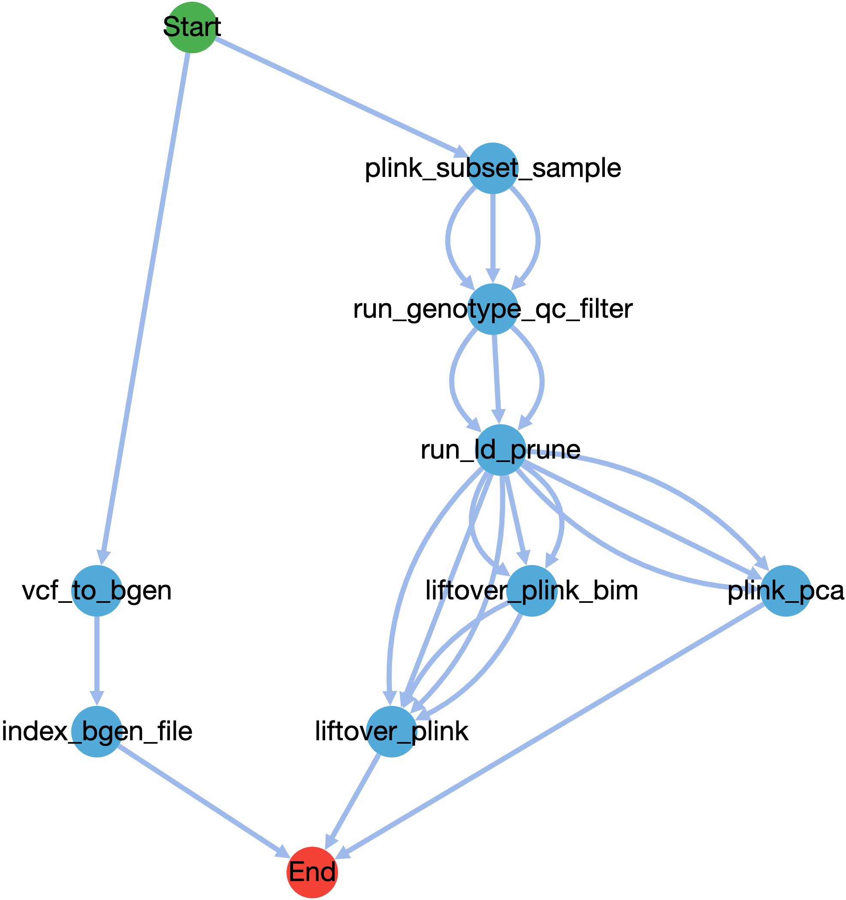

# This is a GWAS pipeline that is intended to be run with biobank size data

The workflow is designed to be modular with a main workflow file that calls the preprocessing subworkflow and (optionally) the GWAS tools.
Currently it supports [Bolt-LMM](https://storage.googleapis.com/broad-alkesgroup-public/BOLT-LMM/BOLT-LMM_manual.html) and [SAIGE](https://github.com/weizhouUMICH/SAIGE). 

## Inputs for the workflow

### genotype files (required) 
* *genotype_bed*, *genotype_bim* and *genotype_fam* are directly genotype files in Plink format
* genotype_samples_to_keep_file: subset of samples to be used  from the genotype file. Need to have FID and IID columns.
* imputed_samples_to_keep_file: subset of samples to be used from the imputed genotype file. Need to have FID and IID columns. 

The first 10 principal components are estimated from the genotype plink files and will be added as covariates for the GWAS analysis. 

### Defining phenotype, covariates and sample sets (required)

The phenotypes, covariates and cohorts are defined by 3 files:  
* covariate_tsv_file: File that contains the sample ID, phenotype, and the covariates used in the association study.
* variable_info_tsv_file: File that defines the columns in the covariate_tsv_file.
* sample_sets_json_file: File that defines the subsets used for the association study. 

More specifically:
The *covariate_tsv_file" is a tab delimited file that includes the id, phenotype and covariates of each subject, here is an example:
```
id is_case  sex age
id1 1 1 56
id2 0 0 60
```

The *variable_info_tsv_file* describes each of the columns that will be used in the analysis, which includes sampleID, phenotype and covarites. These columns/variable names should match with those in the *covariate_tsv_file*. The columns that are not used in the *covariate_tsv_file* do not have to be listed here. The *variable_info_tsv_file* has 4 columns as shown in the example file below. Currently, only *variableName* and *variableType* are used by the pipeline.
* variableName is the column name in the *covariate_tsv_file*
* variableType could be: 
  * sampleID: this variable is the sample id
  * phenotype_quantitative: this variable is a phenotype/target variable and it's a quantitative trait 
  * phenotype_binary: this variable is a phenotype/target variable and it's a binary trait
  * quantitative: this is a quantitative covaraite
  * binary: this is a binary covariate
  * categorical: this is a categorical covariate. The workflow will perform one-hot encoding to turn this variable into N-1 binary variables, where N is the number of categories 
```
variableName    variableType    na_values       transformation
bmi  phenotype_quantitative  NA      no
sex     binary  NA      no
```

The *sample_sets_json_file* defines the different subset of the samples you would like to use as the cohort of the study. For example, this json file defines 3 sets: the complete_set which has no selection criteria, setMale which includes those subjects in the sex column with value equals to 1, and setFemale which includes those subjects in the xex column with value equals to 2. 
Also note that the set name (e.g. complete_set in the example below) will be the appended as the suffix for the gwas result files.
```
{
   "complete_set":[],
   "setMale": [
    {"varname":"sex", "criteria":"include", "value":"1"}
   ],
   "setFemale": [
    {"varname":"sex", "criteria":"include", "value":"2"}
   ]
}
```
   


### Which GWAS tool to use 
* useBOLT: true or false
  * if bolt is used, it requires the genetic_map_file and ld_scores_file
* useSAIGE: true or false


### Imputed files    
The workflow can handle either VCF or bgen files as inputs for the imputed genotype data. The list of the file and their location can be specified as *imputed_list_of_vcf_file* or *imputed_list_of_bgen_file*.

In case that the VCF file is used, the user can provide the *id_delim* string if FID and IID are concat into one ID, if *id_delim* is not provided, double ID is assumed - both FID and IID are the same as sample ID in VCF.    

Finally, if the imputed data and the genotype data are of different genome build, the workflow can liftover the genotype files to match with the imputed data if the user provides the *chain_file*.

### association test programs specific options

*minMAC: minimum minor allele count
*minMAF: minimum minor allele frequency


## workflow steps

* Determine the sample subsets and create covar files for each subset
* The tasks are scattered for each sample subset:
  * The preprocessing steps are summarized in the DAG. 

  * Run on each of the association tool specified
  * Gather the results
  * Make Manhattan and QQ plots 

## Limitations

* Right now this pipeline only works on the 22 human autosomes
* Variable transformation is not yet handled
* Currently, different batches are analyzed together with batch as a covariate, future versions will support meta-analysis of different batches
* The workflow currently points to the latest version of subworkflow on GitHub, this needs to be changed to a particular release instead.
